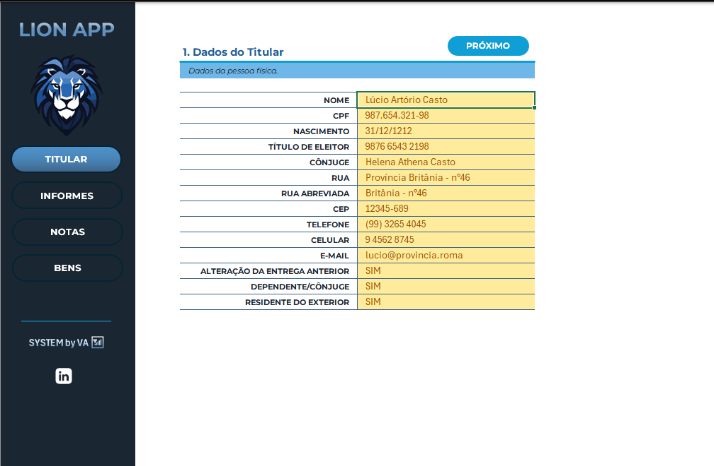
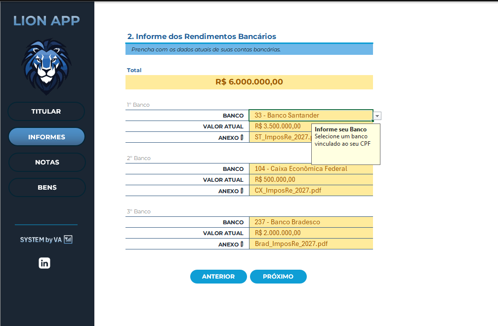
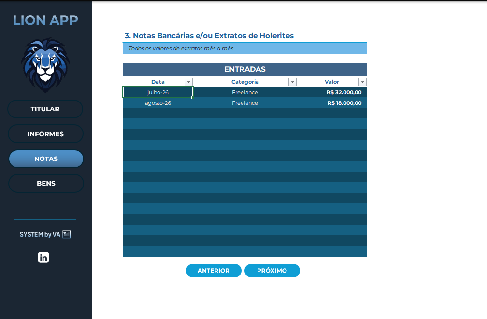
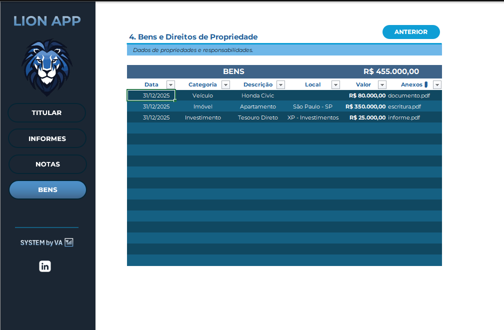
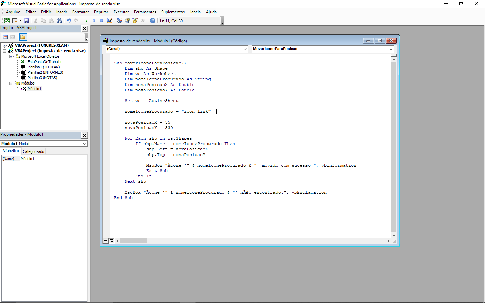

# 🦁 Organizador de Imposto de Renda no Excel

Projeto desenvolvido como desafio prático da **Digital Innovation One (DIO)**, com o objetivo de criar uma ferramenta em Excel para organizar e reunir informações relevantes para a declaração de Imposto de Renda.

A solução utiliza recursos do Excel para estruturar o preenchimento dos dados, incluindo **tabelas, listas suspensas, validação de dados, navegação entre planilhas e recursos de VBA**, buscando proporcionar uma experiência mais organizada e intuitiva ao usuário.

---

## 🎯 Objetivo do Projeto

Construir uma ferramenta de apoio para organização das informações necessárias à declaração de Imposto de Renda, permitindo centralizar diferentes tipos de dados em uma única aplicação desenvolvida no Excel.

O projeto também teve como objetivo aplicar, de forma prática, conceitos apresentados durante as aulas do desafio.

---

## 🛠️ Tecnologias e Recursos Utilizados

* Microsoft Excel
* Tabelas estruturadas
* Formatação e organização de dados
* Validação de dados
* Listas suspensas
* Navegação entre planilhas
* Elementos gráficos e interface visual
* VBA (Visual Basic for Applications)
* GitHub para documentação e versionamento do projeto

---

## 📊 Estrutura da Ferramenta

A aplicação foi organizada em quatro áreas principais:

### 1. TITULAR

Área destinada ao cadastro das informações básicas do titular da declaração.

---

### 2. INFORMES

Área destinada à organização de informações provenientes de informes, como dados relacionados a instituições financeiras e valores.

---

### 3. NOTAS

Área destinada ao registro e organização das informações financeiras inseridas pelo usuário.

---

### 4. BENS

Área acrescentada ao projeto para organização de **Bens e Direitos**, permitindo registrar informações como data, categoria, descrição, valor e referência de documentos.

A coluna de categoria utiliza **lista suspensa**, contribuindo para a padronização e validação dos dados inseridos.

---

## 🔽 Validação e Organização dos Dados

Um dos recursos utilizados no projeto foi a **validação de dados por meio de listas suspensas**.

Esse recurso reduz a possibilidade de entradas inconsistentes e facilita o preenchimento pelo usuário.

Na área de Bens, por exemplo, é possível selecionar categorias previamente definidas em vez de digitá-las manualmente.

---

## ⚙️ VBA

O projeto também utiliza recursos de **VBA (Visual Basic for Applications)** para complementar a navegação e o funcionamento da interface.

Durante o desenvolvimento, foram aplicados códigos apresentados no conteúdo do desafio para auxiliar na interação com os elementos da planilha.

> O objetivo principal deste projeto foi a aplicação prática dos recursos apresentados no desafio, não o desenvolvimento de uma solução VBA do zero.

---

## 🎥 Demonstração

Foi produzido um vídeo curto demonstrando a navegação e o funcionamento da ferramenta.

**Vídeo demonstrativo:** `demo/demo.mp4`

---

## 📸 Visão Geral

A interface foi construída buscando manter um padrão visual entre as diferentes áreas da aplicação, utilizando um menu lateral para facilitar a navegação entre as seções.

O projeto possui quatro áreas principais:

**TITULAR → INFORMES → NOTAS → BENS**

Essa estrutura permite centralizar as informações em uma única ferramenta e facilita sua organização.

---

## 📚 Principais Aprendizados

Durante o desenvolvimento deste projeto, foram praticados conceitos como:

* Organização estruturada de informações no Excel;
* Criação e utilização de tabelas;
* Validação de dados;
* Criação de listas suspensas;
* Organização visual de uma ferramenta em Excel;
* Navegação entre diferentes planilhas;
* Utilização de recursos de VBA;
* Documentação de um projeto técnico;
* Publicação e organização de um projeto no GitHub.

---

## 🚀 Resultado

O resultado é uma ferramenta desenvolvida em Excel para **centralizar e organizar informações relacionadas à declaração de Imposto de Renda**, combinando recursos de organização de dados com uma interface de navegação.

O projeto demonstra a aplicação prática dos conhecimentos trabalhados durante o desafio da DIO.

---

## 📁 Arquivos do Projeto

* `imposto_de_renda.xlsx` — arquivo principal da ferramenta.
* `/images` — capturas de tela das áreas desenvolvidas.
* `/demo` — vídeo demonstrativo do projeto.

---

## 👨‍💻 Projeto

Desenvolvido como parte de um desafio prático da **Digital Innovation One (DIO)**.

[🔗 Meu GitHub](https://github.com/)

---
